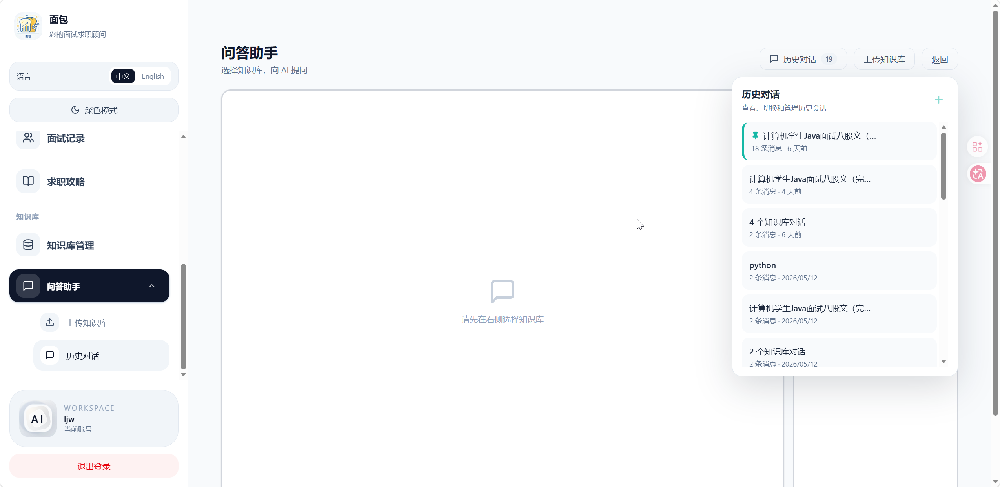
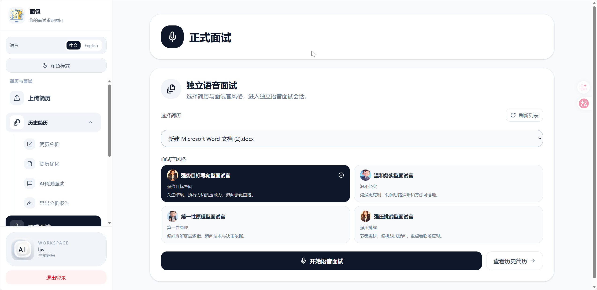
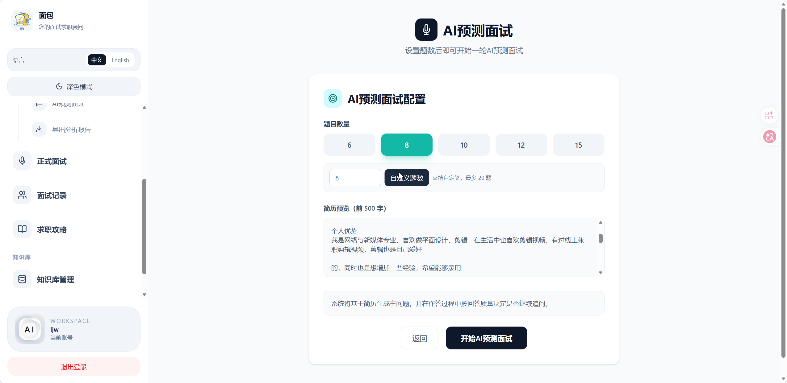
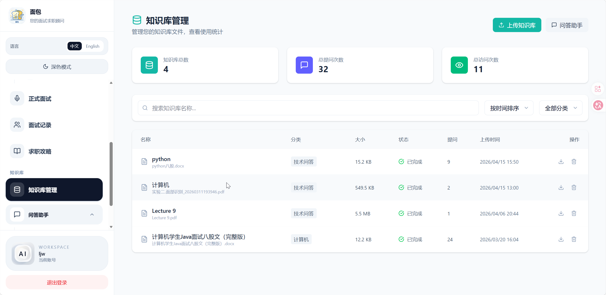
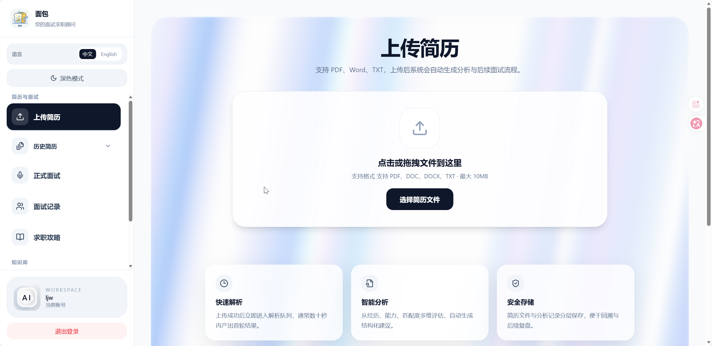
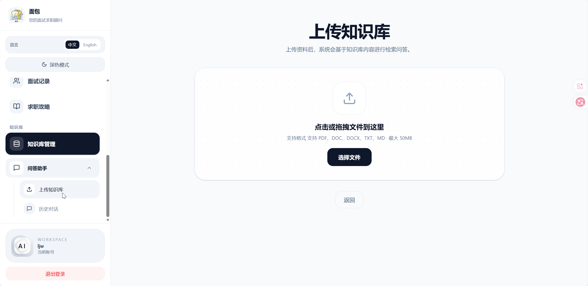
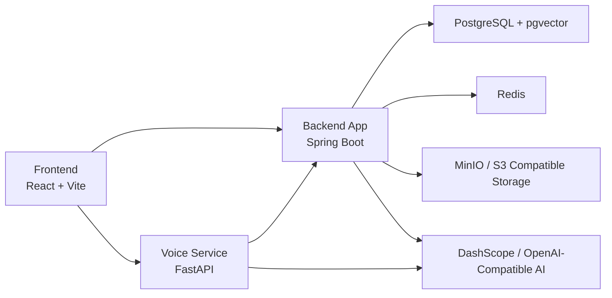

<div align="center">
  
  <h1>AI Interview Platform</h1>
  <p><strong>一套面向简历分析、AI 笔试/面试、知识库问答与后台配置管理的智能面试平台</strong></p>
  <p>Built with Spring Boot, React, FastAPI, PostgreSQL/pgvector, Redis and Docker Compose.</p>

  <p>
    <a href="#简体中文">简体中文</a> |
    <a href="#english-summary">English Summary</a>
  </p>
</div>

---

## 简体中文

### 项目简介

AI Interview Platform 是一套完整的智能面试平台，围绕"上传简历 → AI 分析 → 模拟问答/正式语音面试 → 知识库辅助 → 管理后台配置"这一条业务链路设计。

当前仓库包含：

- **用户端**：登录注册、邮箱验证码、简历上传、历史简历、简历优化导出、模拟面试记录、正式语音面试、知识库问答
- **管理端**：用户管理、管理员密码修改、AI 接口配置、首页展示素材配置、面试官头像配置
- **后端服务**：简历解析、异步分析、问答生成、评分、对象存储、邮件发送、内部配置下发
- **语音服务**：语音识别、语音合成、语音面试链路支撑

### 界面预览

<div align="center">
  <table>
    <tr>
      <td></td>
      <td></td>
    </tr>
    <tr>
      <td align="center">首页 / 用户端</td>
      <td align="center">简历分析</td>
    </tr>
    <tr>
      <td></td>
      <td></td>
    </tr>
    <tr>
      <td align="center">模拟面试</td>
      <td align="center">语音面试</td>
    </tr>
    <tr>
      <td></td>
      <td></td>
    </tr>
    <tr>
      <td align="center">管理后台</td>
      <td align="center">知识库问答</td>
    </tr>
  </table>
</div>

### 核心能力

- **简历分析**：上传 PDF / DOCX / TXT 等简历文件，自动解析并生成结构化分析结果
- **简历优化**：基于简历内容和岗位描述生成优化版简历，并支持 PDF 导出
- **模拟面试**：围绕简历内容自动生成问题、记录答题结果并产出评估
- **正式语音面试**：支持面试官风格切换、语音输入、语音播报和对话记录
- **知识库问答**：支持分类上传资料、向量化检索和对话式问答
- **管理后台**：集中配置 AI 地址/API Key/模型、页面素材、头像、用户状态与密码

### 系统架构



### 技术栈

#### 前端

React 18.3 · TypeScript 5.6 · Vite 5 · React Router 7 · Tailwind CSS 4 · Framer Motion · Recharts · Three.js

#### 后端

Java 21 · Spring Boot 4.0 · Spring AI · Spring Data JPA · Spring Mail · Redisson · Apache Tika · MapStruct · iText 8

#### 语音服务

FastAPI · httpx · DashScope SDK · edge-tts · ffmpeg

#### 基础设施

PostgreSQL 16 + pgvector · Redis 7 · MinIO（S3 兼容）· Docker / Docker Compose

### 目录结构

```text
.
├─ app/                     Spring Boot 后端
├─ frontend/                React 前端
├─ voice-service/           FastAPI 语音服务
├─ docker/                  数据库初始化脚本
├─ docs/                    项目说明与交接文档
├─ screenshot/              项目截图
├─ docker-compose.yml       本地联调编排
├─ docker-compose.prod.yml  服务器部署编排
└─ .env.example             环境变量模板
```

### 快速开始

#### 方式一：Docker Compose 本地启动

1. 复制环境变量模板

```bash
cp .env.example .env
```

Windows PowerShell：

```powershell
Copy-Item .env.example .env
```

2. 填写 `.env` 中至少这些字段

- `AI_BAILIAN_API_KEY` — 阿里云百炼 API Key
- `APP_ADMIN_USERNAME`
- `APP_ADMIN_PASSWORD`

3. 启动服务

```bash
docker compose up -d --build
```

4. 常用访问地址

| 服务 | 地址 |
|------|------|
| 用户端 | `http://localhost` |
| 管理端 | `http://localhost/admin` |
| 后端 API | `http://localhost:8080` |
| 语音服务 | `http://localhost:8091` |
| PostgreSQL | `localhost:55432` |
| MinIO Console | `http://localhost:19001` |

#### 方式二：服务器部署

```bash
docker compose -f docker-compose.prod.yml up -d --build
docker compose -f docker-compose.prod.yml ps
```

推荐做法：

1. 仅将前端容器暴露到反向代理
2. 使用 Nginx / 宝塔反向代理到 `127.0.0.1:3000`
3. 为站点配置 HTTPS
4. 将数据库、Redis、MinIO 保持内网访问

### 环境变量说明

| 变量 | 说明 |
| --- | --- |
| `AI_BAILIAN_API_KEY` | DashScope / 百炼 API Key（**必填**）|
| `AI_MODEL` | 文本模型名称（默认 qwen-plus）|
| `VOICE_QWEN_MODEL` | 语音模型名称 |
| `APP_ADMIN_USERNAME` | 管理员用户名 |
| `APP_ADMIN_PASSWORD` | 管理员密码 |
| `APP_MAIL_HOST` | SMTP 主机 |
| `APP_MAIL_PORT` | SMTP 端口 |
| `APP_MAIL_USERNAME` | SMTP 用户名 |
| `APP_MAIL_PASSWORD` | SMTP 密码 |
| `APP_TURNSTILE_SECRET_KEY` | Turnstile 服务端密钥 |
| `VITE_TURNSTILE_SITE_KEY` | Turnstile 前端站点密钥 |
| `POSTGRES_PASSWORD` | PostgreSQL 密码 |
| `APP_STORAGE_ACCESS_KEY` | 对象存储 Access Key |
| `APP_STORAGE_SECRET_KEY` | 对象存储 Secret Key |
| `APP_INTERNAL_VOICE_TOKEN` | 后端与语音服务的内部鉴权令牌 |

完整变量列表请参考 `.env.example`。

### 开发说明

#### 前端

```bash
cd frontend
pnpm install
pnpm dev
```

#### 后端

```bash
./gradlew.bat test
./gradlew.bat :app:bootRun
```

#### 语音服务

```bash
cd voice-service
pip install -r requirements.txt
uvicorn main:app --host 0.0.0.0 --port 8091
```

### 测试与构建

```bash
# 前端构建
cd frontend && pnpm build

# 后端测试
./gradlew.bat test

# 后端打包
./gradlew.bat :app:bootJar
```

### 致谢与声明

- 本项目借鉴了 [Snailclimb/interview-guide](https://github.com/Snailclimb/interview-guide)，感谢原作者的卓越工作
- 部分代码由 AI 辅助生成
- 本项目使用**自定义非商业许可协议**，详见 [LICENSE](LICENSE)

---

## English Summary

AI Interview Platform is a full-stack AI interview platform covering resume analysis, resume rewriting, simulated interviews, real-time voice interviews, knowledge-base Q&A, and admin configuration.

### Features

- **Resume Analysis**: Upload PDF/DOCX/TXT, auto-parse and generate structured analysis
- **Resume Rewriting**: Generate optimized resumes based on content and job descriptions, with PDF export
- **Mock Interviews**: AI-generated questions, answer recording, and evaluation
- **Voice Interviews**: Real-time voice conversations with multiple interviewer personas
- **Knowledge Base RAG**: Upload documents, vector search, and conversational Q&A
- **Admin Panel**: Configure AI models, API keys, page content, user management

### Tech Stack

| Layer | Technologies |
|-------|-------------|
| Frontend | React 18.3, TypeScript, Vite, Tailwind CSS |
| Backend | Java 21, Spring Boot 4.0, Spring AI, PostgreSQL/pgvector, Redis |
| Voice | FastAPI, DashScope SDK, edge-tts |
| Infrastructure | Docker Compose, MinIO (S3) |

### Quick Start

```bash
# 1. Clone
git clone https://github.com/xiaohaowen21/ai-interview-platform.git
cd ai-interview-platform

# 2. Configure
cp .env.example .env
# Edit .env → set AI_BAILIAN_API_KEY

# 3. Launch
docker compose up -d --build
```

Then visit `http://localhost` (user frontend) or `http://localhost/admin` (admin panel).

### License

**Non-Commercial License** — Free for personal learning, teaching, and non-profit use. Commercial use and competition submission are prohibited. See [LICENSE](LICENSE) for details.

### Acknowledgments

- This project is inspired by [Snailclimb/interview-guide](https://github.com/Snailclimb/interview-guide) — thanks to the original author
- Some portions of the code were generated with AI assistance
